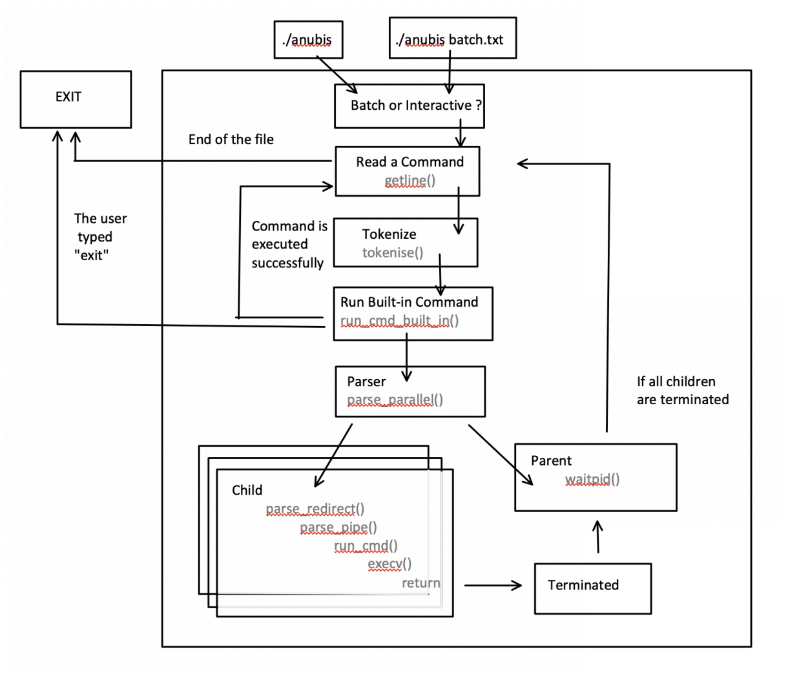
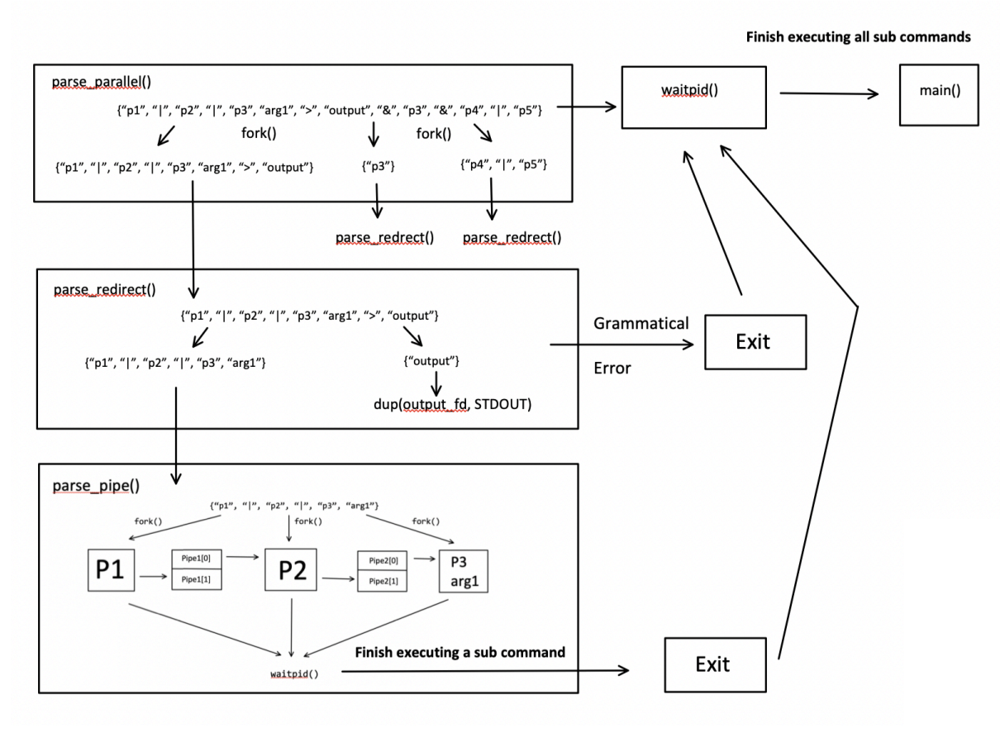
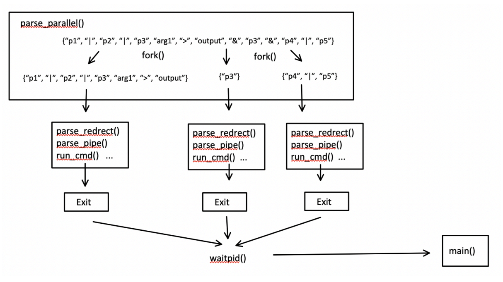
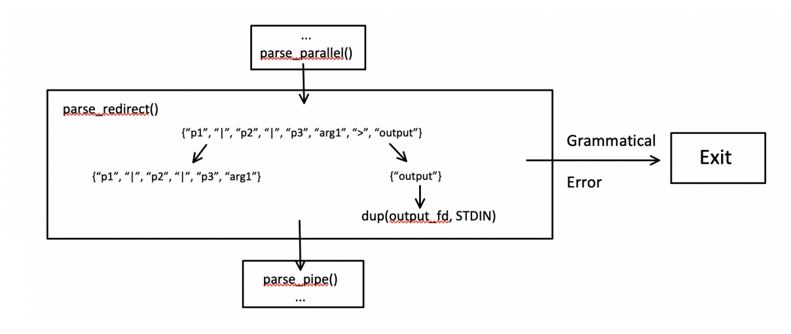
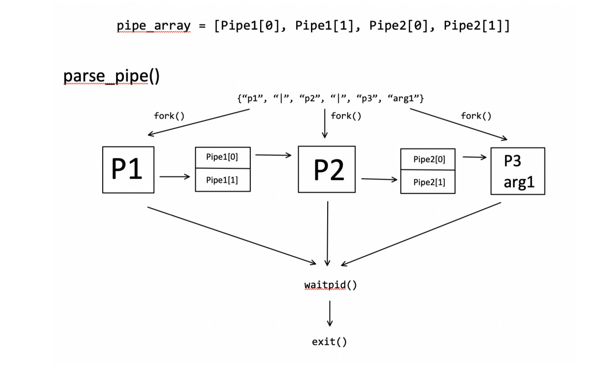
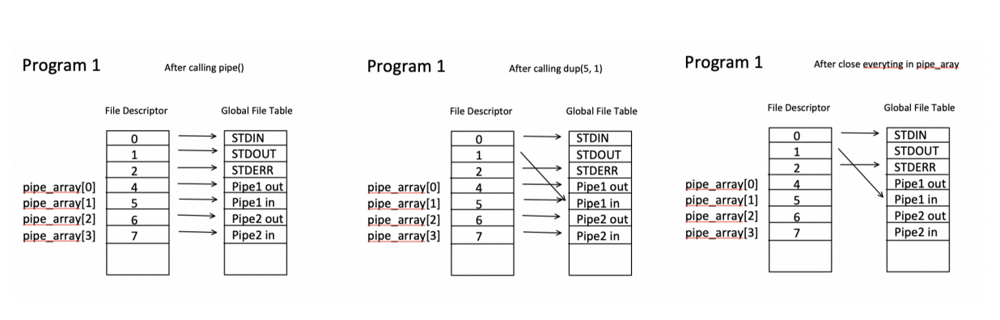
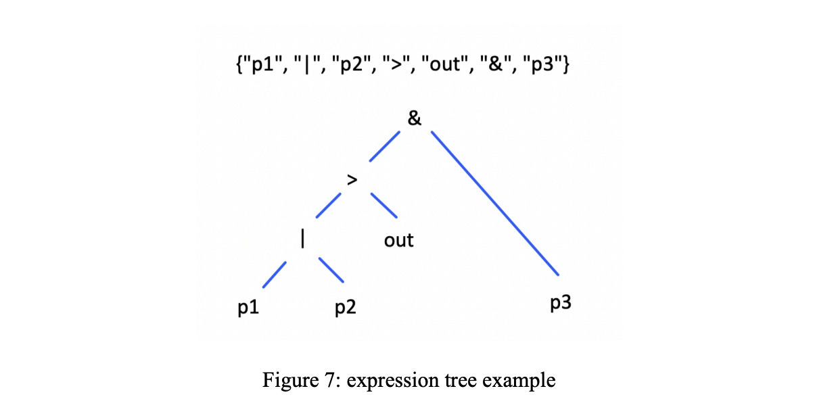
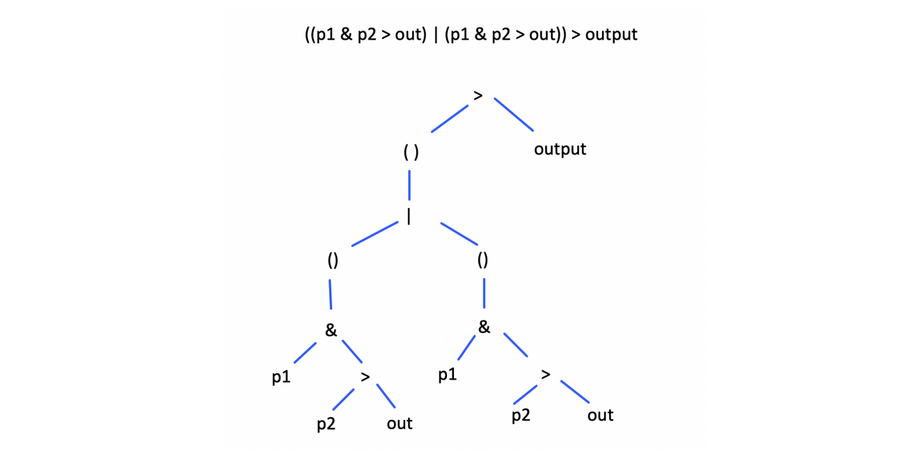

## Table of Contents  
1. [Introduction](#1-introduction)  
2. [Custom Data Types](#2-custom-data-types)  
3. [Overall Structure](#3-overall-structure)  
4. [Tokenizer](#4-tokenizer)  
5. [Parser](#5-parser)  
   - [5.1 parse_parallel()](#51-parse_parallel)  
   - [5.2 parse_redirect()](#52-parse_redirect)  
   - [5.3 parse_pipe()](#53-parse_pipe)  
   - [5.4 run_cmd()](#54-run_cmd)  
   - [5.5 Design Strategy for Parser](#55-design-strategy-for-parser)

---

## 1. Introduction

The program `anubis.c` is a basic command line interpreter (CLI) or shell that can run programs given an input command containing program path(s) or name. The inputs can be either read from the standard input (interactive mode) or a file (batch mode).

In addition to running a single program and outputting to the screen, `anubis.c` can also run multiple programs in parallel, chain them into a pipeline, or redirect outputs. `anubis.c` also supports some common built-in commands, including `cd`, `path`, and `exit` to help users navigate through different directories to select a program. A detailed specification can be found in `./anubis/README.md`.

---

## 2. Custom Data Types

To facilitate programming, two custom data types (struct), `string_list` and `pid_list`, and their associated helper functions have been used throughout the code (line 38 to line 142). Throughout the report, a list is represented by `{ }`, while an array is represented by `[ ]`.

- `string_list` is an extended version of an array of strings that can automatically allocate memory and track how much memory is used. It is mainly used for holding tokens. The utility functions include:

  - `string_list_create()` – Create a list by allocating some memory  
  - `string_list_free()` – Free all memory for the list  
  - `string_list_add()` – Add an element and allocate more memory if needed  
  - `string_list_sublist()` – Get a sub-list (deep copy) given indexes  
  - `string_list_print()` – Print the list  

- `pid_list` is similar to `string_list`, but is used for a parent process to manage child processes, especially when running programs in parallel.

---

## 3. Overall Structure



The flowchart in Figure 1 shows the overall structure in `main()` (line 449 to line 508). The program first determines whether the input is from the user keyboard or a file. Then, it enters a loop to keep reading command lines until the end of the file is reached or the user types `exit`.

Each loop:
- Tokenizes the command string into a list
- Tries `run_cmd_built_in()`
- If not a built-in, passes to the parser (`|`, `>`, `&` support)
- Executes commands based on operator precedence
- Waits for completion and reaps child processes

---

## 4. Tokenizer

The tokenizer (line 149 to line 183) turns a command string into a list of tokens, not just by spaces, due to possible input like:

```
./p1 arg1&./p1>output.txt
```

Instead, the tokenizer:
1. Treats spaces, tabs, and returns as token boundaries.
2. Detects special characters (`&`, `>`, `|`) and separates them into their own tokens.
3. Keeps track of the token start address (`char * token`).
4. Replaces delimiters with `\0`, then adds the token to the list.

If the character is:
- Space/tab/return → null-terminate and add token  
- `&`, `>`, `|` → null-terminate and add token + operator  
- Anything else → continue scanning  
- Final `\0` → add token if non-empty  

---

## 5. Parser

The parser handles:
- Parallelism (`&`)
- Output redirection (`>`)
- Pipelines (`|`)

Example input token list:
```text
{“p1”, “|”, “p2”, “|”, “p3”, “arg1”, “>”, “output”, “&”, “p3”, “&”, “p4”, “|”, “p5”}
```



---

### 5.1 parse_parallel()



- Splits the token list by `&`
- Each sub-command (e.g. `{“p1”, “|”, “p2”, “|”, “p3”, “arg1”, “>”, “output”}`) is processed in a separate child
- Each child calls `parse_redirect()`
- Once all children terminate, return to `main()`

---

### 5.2 parse_redirect()



- Splits token list by `>`
- Input: `{“p1”, “|”, “p2”, “|”, “p3”, “arg1”, “>”, “output”}`  
  Output: `[{“p1”, “|”, “p2”, “|”, “p3”, “arg1”}, {“output”}]`
- Performs grammar checks:
  - Only 1 or 2 parts allowed
  - First part must be non-empty
  - Second part must contain exactly one string (filename)
- Redirects stdout using `dup()` if redirection is specified
- Passes the first part to `parse_pipe()`

---

### 5.3 parse_pipe()



- Splits input by `|`
- Example: `{“p1”, “|”, “p2”, “|”, “p3”, “arg1”}` → `[{“p1”}, {“p2”}, {“p3”, “arg1”}]`
- Sets up pipes using `pipe_array`
- Forks a child per command
- Sets appropriate input/output redirection:
  - First: redirect output only
  - Middle: redirect input and output
  - Last: redirect input only
- Closes all descriptors in child before calling `run_cmd()`



Parent waits for all children to finish.

---

### 5.4 run_cmd()

- Searches user-specified paths for the program
- If found: prepends directory and runs using `execv()`
- If not found: tries executing directly
- On `execv()` failure: prints error and exits

---

### 5.5 Design Strategy for Parser

The parser design is driven by the command grammar:

- Only 3 operators: `|`, `>`, `&`
- Fixed precedence, no brackets
- So parser has a fixed structure: 3 layers deep

This enables a clean 3-phase parse:
1. `parse_parallel()`
2. `parse_redirect()`
3. `parse_pipe()`



If brackets were supported, the parser would become recursive and arbitrary-depth:

